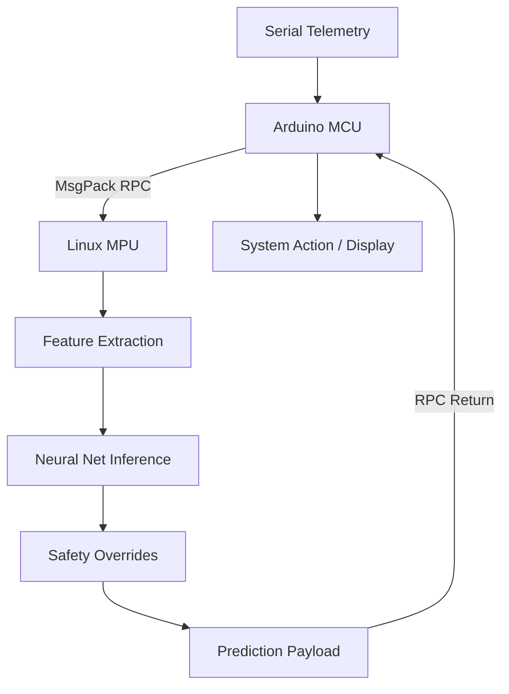

# NeuralGrid: Edge AI Electrical Anomaly Detection

[](https://store.arduino.cc/)
[]()
[]()
[]()

A research-grade **Edge AI** system deployed on the **Arduino Uno Q** dual-core architecture. NeuralGrid leverages a high-performance Linux MPU for real-time neural network inference and a deterministic Arduino MCU for safe electrical actuation and telemetry acquisition.

---

## 🚀 Overview

NeuralGrid is designed to mitigate electrical hazards in industrial environments through a hybrid intelligence model. By combining a **14-feature Time-Series Neural Network** with a **Hard Deterministic Safety Rule Engine**, the system achieves high-accuracy anomaly detection with sub-cycle fault recovery.

### Key Capabilities
- **Dual-Core Execution:** Seamless IPC using **MsgPack RPC** over the `Arduino_RouterBridge` framework.
- **Deep Feature Engineering:** 14-point telemetry vector including derivatives ($dI/dt$), variance, and accumulative thermal indexing.
- **Hysteresis-Free Recovery:** Advanced buffer management enabling single-cycle recovery from severe overload events.
- **Hybrid Fusion:** Combines probabilistic AI predictions with rigid safety overrides for zero-fail reliability.

---

## 🏗️ System Architecture

The architecture utilizes the unique dual-processor capability of the Arduino Uno Q:

| Core | Role | Components |
| :--- | :--- | :--- |
| **Linux MPU** | Intelligence Layer | Python AI Engine, Feature Pipeline, Safety Rules. |
| **Arduino MCU** | Actuation Layer | Serial I/O, IPC Bridge, Relay Control. |

### Information Flow


---

## 📂 Directory Structure

```text
.

├── docs/                       # Architecture & IPC Documentation
│   ├── ai_pipline.md           # Intelligence Engine (Python)
│   └── ipu_architecture.md 
└── README.md                   # System Overview
└── License                     # MIT License
```

---

## 🛠️ Engineering Solutions

| Challenge | Solution |
| :--- | :--- |
| **JSON Corruption** | Implemented hardware-level carriage return filtering in the MCU UART buffer. |
| **Recovery Lag** | Developed a **Buffer Hysteresis Purge** logic to clear rolling memory on rapid step-changes. |
| **Derivative Spikes** | Integrated a buffer auto-purge condition to suppress noise in light-load transitions. |

---

## ⚖️ License
Distributed under the MIT License. See `LICENSE` for more information.
