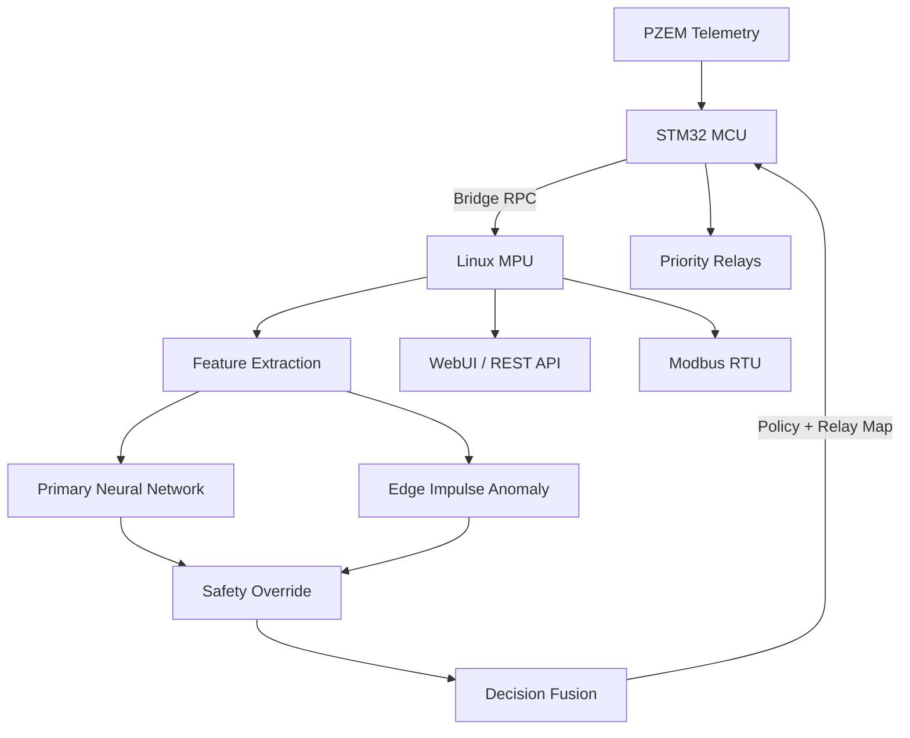

# Edge AI Industrial Grid Intelligence

[](https://store.arduino.cc/)
[]()
[]()
[]()
[]()

> **Development Note**  
> This project is in the **prototyping stage** and is currently being tested only at **low ampere levels**.  
> It is under active development and is **not production-ready**. All safety and control behaviour must be treated as experimental.

---

## Overview

Grid is a dual-brain Edge AI platform for real-time electrical monitoring, anomaly detection, and priority-based load control. It runs on the **Arduino Uno Q**, combining a high-performance Linux MPU for neural inference with a deterministic STM32 MCU for safe actuation and telemetry.

The system fuses a **14-feature neural network**, an **Edge Impulse time-series anomaly detector**, and a **hard deterministic safety engine** to deliver early warning and hierarchical load shedding.

### Key Capabilities
- **Dual-Processor Architecture** — STM32 MCU (real-time control) + Qualcomm Linux MPU (AI & analytics)
- **14-Feature Neural Network** — Pure NumPy classifier with softmax confidence
- **Edge Impulse Anomaly Detection** — Independent time-series model with configurable threshold
- **Deterministic Safety Override** — Hard physical limits that cannot be bypassed by AI
- **Priority Load Shedding** — Four-channel hierarchical relay control
- **Modbus RTU** — Industrial communication interface
- **Live WebUI + REST API** — Real-time dashboard and status endpoints

---

## System Architecture

| Core              | Role                  | Responsibilities                                      |
|-------------------|-----------------------|-------------------------------------------------------|
| **Linux MPU**     | Intelligence Layer    | Feature engineering, Primary NN, Edge Impulse, Fusion, WebUI, Modbus |
| **STM32 MCU**     | Actuation Layer       | Telemetry acquisition, Relay control, Bridge RPC, Timing |

### Information Flow



---

## AI Model Working

### Primary AI — 14-Feature Neural Network
A fully-connected neural network performs 4-class classification:

| ID | Class                    |
|----|--------------------------|
| 0  | NORMAL                   |
| 1  | LOAD_INCREASE_WARNING    |
| 2  | OVERLOAD_RISK            |
| 3  | CRITICAL_CONDITION       |

**Feature Vector**
- Voltage, Current, Power, Energy, Frequency, Power Factor
- Load Priority, Voltage Deviation, PF Deviation, Utilization
- dI/dt, dV/dt, Current Variance, Thermal Index

**Inference Path**
1. Feature alignment & StandardScaler (`scaler.pkl`)
2. Forward pass (ReLU hidden layers → Softmax output)
3. Class = argmax(probabilities), Confidence = max probability
4. Weights loaded from `weights.pkl` (pure NumPy, no heavy framework at runtime)

### Secondary AI — Edge Impulse Anomaly Detector
- 8-axis input window: `[V, I, P, PF, F, dI/dt, dV/dt, Variance]`
- Rolling window automatically sized from model
- Anomaly score (0–100 scale), threshold = **75.0**
- Raises an independent anomaly flag

### Decision Fusion
1. **Safety Override** escalates class on hard limits (over-current, under/over-voltage, low PF)
2. **Fusion Engine** maps final class + anomaly flag into a policy command (0–4)
3. Policy directly drives hierarchical relay shedding (Critical → High → Low → Auxiliary)

---

## Engineering Highlights

| Challenge                  | Solution                                                                 |
|---------------------------|--------------------------------------------------------------------------|
| AI vs Safety              | Deterministic override layer always has priority over neural prediction |
| Recovery from step changes| Rolling history buffers are purged on major load transitions            |
| Lightweight edge inference| Pure NumPy forward pass + Edge Impulse runner (no TensorFlow runtime)   |
| Industrial integration    | Modbus RTU implemented for PLC / SCADA connectivity                     |
| Operator visibility       | Live WebUI + REST API exposing full AI reasoning chain                  |

---

## Directory Structure

```text
Grid/
├── README.md      
├── LICENSE
├── firmware/                      # Under Review, will be uploaded shortly 
│   ├── linux-mpu/
│   │   └── main.py              # AI engine, fusion, WebUI, Modbus
│   ├── stm32/                   # Real-time control & actuation
│   └── models/
│       ├── weights.pkl
│       ├── scaler.pkl
│       └── model.eim
└── docs/                        # Additional documentation (future)
```

---

## Current Status

| Subsystem                        | Status              |
|----------------------------------|---------------------|
| PZEM Measurement                 | Implemented         |
| 14-Feature Neural Network        | Implemented         |
| Edge Impulse Anomaly Detector    | Implemented         |
| Deterministic Safety Override    | Implemented         |
| Decision Fusion & Policy Engine  | Implemented         |
| Priority Relay Control           | Implemented         |
| Bridge RPC                       | Implemented         |
| WebUI + REST API                 | Implemented         |
| Modbus RTU                       | Implemented         |
| High-current validation          | Not started         |
| Functional safety certification  | Future work         |

---

## Licence & Disclaimer

Distributed under the MIT License. See `LICENSE` for more information.

**This is an experimental prototype.**  
It is currently tested only at low ampere levels and must not be deployed in production or safety-critical environments without further validation and certification.
